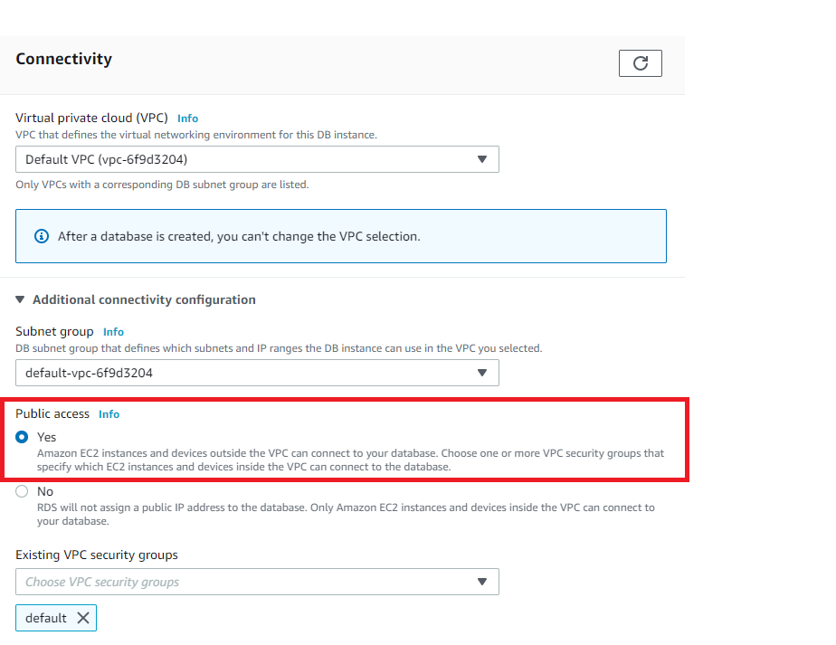
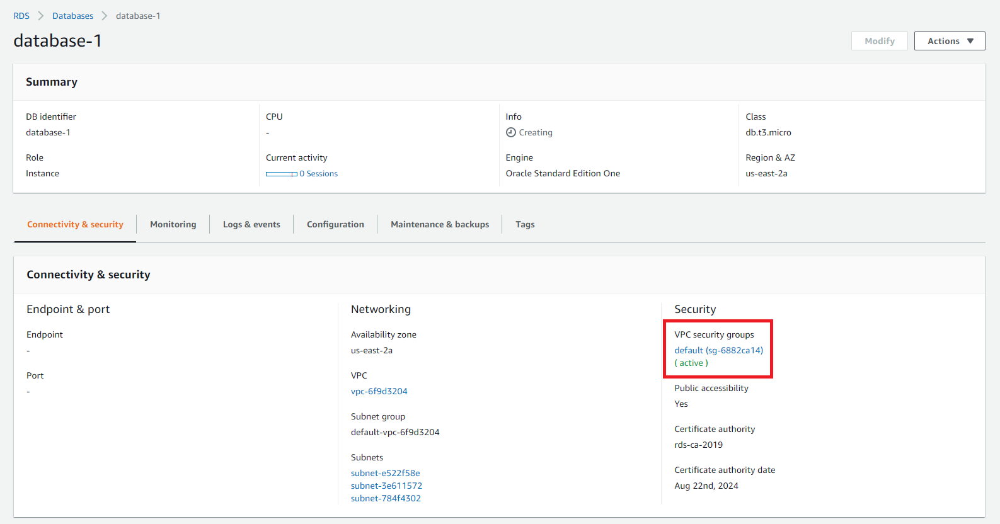
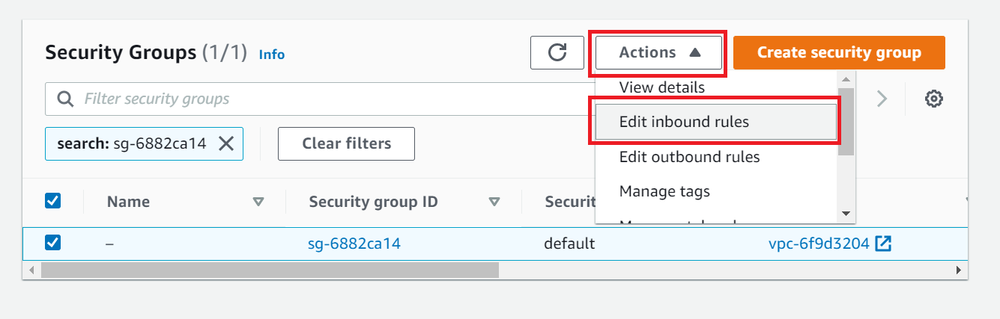
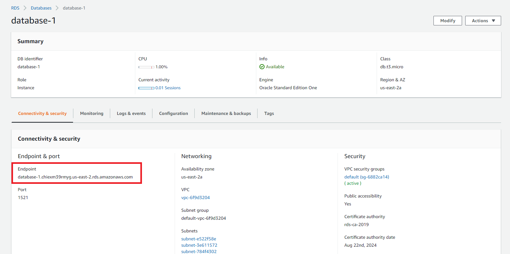
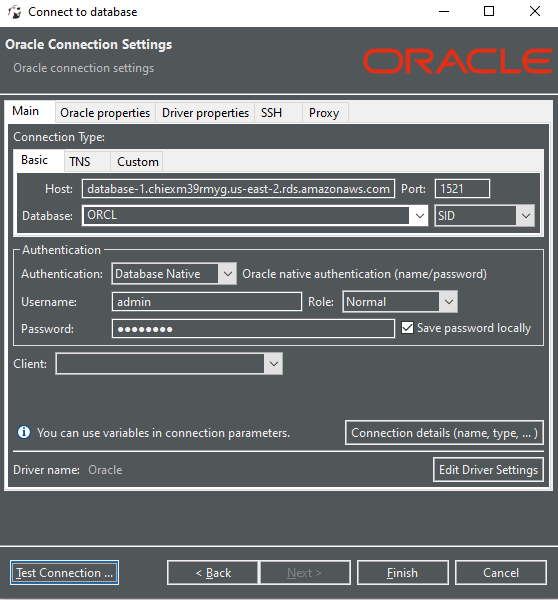

# How to Configure and Connect to an Amazon RDS Engine from DBeaver 	:computer:
Want to learn more about **what** and AWS RDS is? Go [here](https://github.com/210222-reston-java-msa/demos/blob/main/week2/RDS-setup-guide/rds-overview.md)

## :exclamation: IMPORTANT Wherever you see the word <code>Oracle</code> please use <code>PostgreSQL</code> :exclamation:

Login to your [AWS account](https://aws.amazon.com/) first. If you haven't created an AWS account yet, go ahead and create one [here](https://portal.aws.amazon.com/billing/signup?nc2=h_ct&src=header_signup&redirect_url=https%3A%2F%2Faws.amazon.com%2Fregistration-confirmation#/start), and then follow the steps below:

1. Upon logging in, navigate to the *RDS Dashboard* by searching `RDS` and clicking the first result. Click **Create database**.

3. Select the following configurations:
    * `Standard Create`
    * Engine Type: `Oracle`
    * Edition: `Oracle Standard Edition One`
    * Templates: `Free tier`
    * Master username: `admin`
    * Password: `12345678` or something easy to remember

4. Under **Connectivity** > **Additional connectivity configuration** > **Public access**, click `Yes`.

5. Click `Create database`.  It will take about 2 minutes for AWS to configure your database.

6. Navigate to `Databases` and select the database instance that you just created.  It will probably be along the lines of `database-1`. Click on your default VPC. 

> Despite having set public accessibility, we will need to configure your **VPC (Virtual Private Cloud)** to allow inbound/outbound traffic from any IP.

7. Click `Actions` > `Edit inbound rules`

8. Set the `Source` from `Custom` to `Anywhere`.  Ideally, we would set this to the IP address of members with priveleges to access this network - but we will set it to `Anywhere` for the sake of demonstration.  Click `Save rules`.

9. Repeat Step 8 for `Outbound rules`.  You have now successfully modified your default security group.

10. Return to your database instance dashboard and copy the `Endpoint`.

11.  Open DBeaver.  Create a new connection, and select `Oracle`. Configure your connection like so:
    * Host: *paste the copied endpoint here (i.e* `database-1.chiexm39rmyg.us-east-2.rds.amazonaws.com`*)*
    * Port: `1521`
    * Database: `ORCL`
    * Change `Service Name` to `SID`
    * Username: `admin`
    * Password: `12345678`

12. Click `Test Connection`.  It should say `Connected`.  Once it is, click `Finish`

