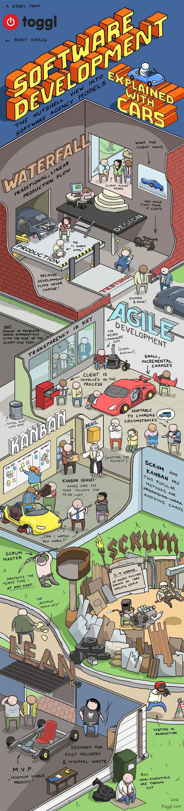

# Project-2 Requirements
Within groups of 4 or 5, you are required to develop an application using the following mandatory technologies.
#### Presentation Date: Wednesday March 31st, 2020
You will present this application as if you were pitching it to a board or to investors.
When you're presenting, you're welcome to provide a brief slideshow demonstrating the technologies involved in the app, it's features, and the Agile Development Process you undewent to develop it.

## Required Technologies
- Spring MVC
- Angular
- Consume a RESTful API
- Amazon RDS
- Hibernate
- GitHub (*Each team must maintain a repository to which all members contribute*)
- Unit Tests & Logging
- Roadmap Presentation
  > Present your app with a slide show (Roadmap) and talk us through any extra technologies you implemented either within your application or to track the progress of your sprint.

## Required User Stories
- Login/Logout
- Register
- Anything else

## Extra Credit
- Deploy on an EC2
- Set up a Jenkins Pipeline for the Project

## ⁉️ What's Due Friday March 19th by 11am? ⁉️
- **Project Proposal** - you're welcome to use the word document provided in this directory or make a copy of [this google doc](https://docs.google.com/document/d/1F2UKzwIcsxWdGlY5bIsM6XfOyx2NAPiL0VXWOLcLTkk/edit?usp=sharing)
  > Slack this document to Sophia.  The proposal is a brief description of your application, team members, and Team Lead.
  > The *Team Lead* represents the point of contact for the team and will be reporting updates in every morning's standup.
- You will have you your first Stand-Up at 10:00am that morning, introducing your project idea and speaking on your planning process.

## Agile Scrum Guidelines
For software teams, the stand-up is like the team’s huddle. It’s even commonly known as the daily scrum, and reinforces “we” to keep everyone aware of the team’s landscape and progress.
- Every morning, at 10:00am you will have a Daily Standup of about 5-10 minutes.
- At the end, each **Lead** will report to the Scrum Master (Sophia) about the current status of the project and any blockers you're facing or have resolved

### In your Team Standups Use the 3 question agenda:
*Lead asks each attendee to answer these questions.*
  1. *What have I done since the last meeting?*
  2. *What do I plan to complete before the next meeting*
  3. *What problems am I likely to face?*
*Don’t spend too much time on status updates. Focus on what needs to be done and the problems or impediments that may arise.*
> Of course, your team is responsible for holding additional planning and collaboration meetings -- stand-ups are simply a check-in.

## Suggestions:
- Use a [Kanban Board](https://www.atlassian.com/agile/kanban/boards) like [Trello](https://trello.com/?&aceid=&adposition=&adgroup=105703214328&campaign=9843285532&creative=437184392320&device=c&keyword=trello&matchtype=e&network=g&placement=&ds_kids=p53016490704&ds_e=GOOGLE&ds_eid=700000001557344&ds_e1=GOOGLE&gclid=Cj0KCQiA2af-BRDzARIsAIVQUOfgZifIwr-ClvNLXs4m9zn7VFhTU4bXoVdq1iBVe7SNfiXGeVVNKlgaAsHAEALw_wcB&gclsrc=aw.ds)
- Use a [Burndown Chart](http://www.agilenutshell.com/burndown)

<h2>If Software were Built Like Cars...(Waterfall vs. Agile)</h2>

