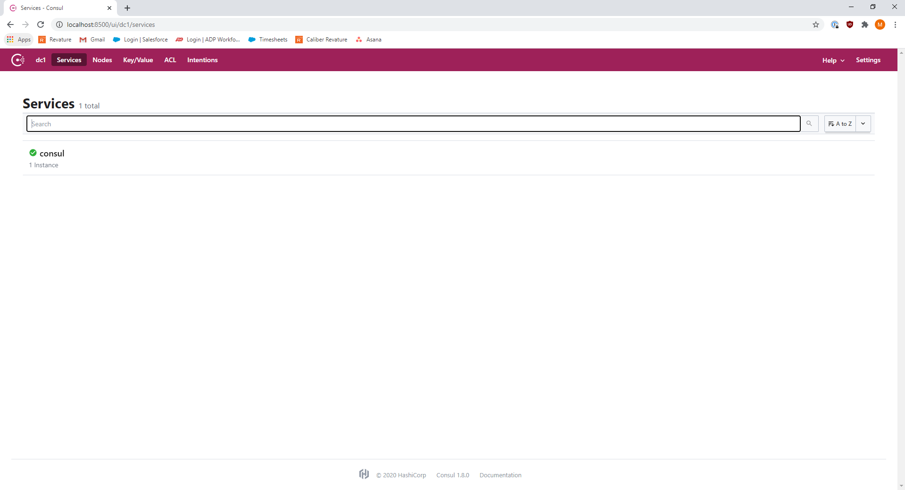

# Phase 2: Manage our Services

In this phase we will address the growing maintenence of tracking/managing our services. In the previous phase we found that it will become increasingly difficult to maintain our application as it grows larger with its current architecture. To resolve this, we will create two additional services, and modify our original services to leverage Service Discovery and an API Gateway.

The end result of this phase will be provided for comparison.

## Step 1: Create a Gateway Service

It was a bit tedious before how we had to switch the port in use when we wanted to switch between our services. We can address this with an API Gateway. This will be an independent service that will receive all of our requests first, and then redirect them to the appropriate service. This will make it much more convenient for end users of our application.

Create a new Spring Boot Project named gateway-service with the Starter Dependencies listed below:

* Gateway
* Spring Boot Actuator
* Spring Boot DevTools

Convert the `application.properties` file into `application.yml` by right clicking the `application.properties` file and choosing `Convert .properties to .yaml`.

Add the following to the `application.yml` file of gateway-service:

```yaml
server:
  port: 8080

spring:
  application.name: gateway
  cloud:
    gateway:
      default-filters:
      - PrefixPath=/
      routes:
      # ============================
      - id: flashcard
        uri: http://localhost:8089
        predicates:
        - Path=/flashcard/**
      # ============================
      - id: quiz
        uri: http://localhost:8090
        predicates:
        - Path=/quiz/**
```

You might notice that our gateway-service is referencing our flashcard and quiz services on ports 8089 and 8090 respectively. This is because we would prefer to have our gateway-service on port 8080, and so we will have to change where are other 2 services are.

## Step 2: Update Other Services

We must now update the `application.properties` files for both our flashcard-service and quiz-service to be on ports 8089 and 8090 respectively. Update them according to the below snippet:

flashcard-service:
```properties
server.port=8089
```

quiz-service:
```properties
server.port=8090
```

Additionally, we must update our RestTemplate to use our new gateway-service.

Update the `getCards` method in the `QuizController` according to the below snippet:

```java
  @GetMapping("/cards")
  public ResponseEntity<List<Flashcard>> getCards() {
    List<Flashcard> all = this.restTemplate.getForObject("http://localhost:8080/flashcard", List.class);

    if(all.isEmpty()) {
      return ResponseEntity.noContent().build();
    }

    return ResponseEntity.ok(all);
  }
```

Now we can send a GET request to `localhost:8080/quiz/cards` or `localhost:8080/flashcard` and they both provide the same response, as expected.

But we still have the issue of needing to update our gateway-service every time each of our services change location. Additionally, it's a bit inconvenient that our RestTemplate has to send a request first to the gateway, which will then be redirected back to the flashcard-service. It would be much more efficient if our services could dynamically discover each other and directly communicate as needed.

This is where Consul comes in.

## Step 3: Run Consul Agent

Run a Consul Agent locally with docker (Default port is 8500) with:
`docker run -d --name consul -p 8500:8500 consul`

If you do not have docker, you can download consul manually [here](https://www.consul.io/downloads).
You will need to extract the zip folder, which only contains a single file: `consul.exe`.
Open Git Bash in the same folder as the `consul.exe` file and run it with:
`./consul.exe agent -server -bootstrap-expect=1 -data-dir=consul-data -ui -bind=$(ipconfig | grep 'IPv4' | grep -Eo '192.168.*' | head -1)`

This command will run the agent inside Git Bash by binding it to one of your IPv4 addresses (if you have multiple).

You can check if it is available by navigating to `http://localhost:8500/ui` in your browser.



## Step 4: Enable Service Discovery

Perform the below steps for each of the following services:

* quiz-service
* flashcard-service
* gateway-service

1. Add the `Consul Discovery` starter dependency by right clicking each project and choosing `Spring > Edit Starters`

2. Add the `@EnableDiscoveryClient` annotatation to each `@SpringBootApplication` class like below:

```java
@EnableDiscoveryClient
@SpringBootApplication
public class QuizServiceApplication {

  public static void main(String[] args) {
    SpringApplication.run(QuizServiceApplication.class, args);
  }
}
```

## Step 5: Update Gateway

Now that we have a Consul Agent available, we will want to go back and allow our gateway-service to route to any instance of the services, instead of routing to a specific service on a specific port. Additionally, we would like to leverage the same with our RestTemplate in the `QuizController` of quiz-service.

Update the `application.yml` file of gateway-service to the following:

```yaml
server:
  port: 8080

spring:
  application.name: gateway
  cloud:
    gateway:
      default-filters:
      - PrefixPath=/
      routes:
      # ============================
      - id: flashcard
        uri: lb://flashcard
        predicates:
        - Path=/flashcard/**
        filters:
        - StripPrefix=1
      # ============================
      - id: quiz
        uri: lb://quiz
        predicates:
        - Path=/quiz/**
        filters:
        - StripPrefix=1
```

By removing the `locahost` and adding the `lb` prefix, we are telling Spring Cloud Gateway to load balance across the instances of the services with the corresponding name.

The additional filter here will remove the `/quiz` or `/flashcard` part of the URI as the request is being routed. This allows us to remove the extra `@RequestMapping` annotations in our quiz-service and flashcard-service.

## Step 6: Update Other Services

Update the `spring.application.name` properties in quiz-service and flashcard-service to the following:

quiz-service:
```properties
spring.application.name=quiz
```

flashcard-service:
```properties
spring.application.name=flashcard
```

We also remove the `@RequestMapping` annotation at the top of our `QuizController` and `FlashcardController` classes since now Gateway will be handling the routing based on URI.

Finally, the last step would be to modify the url that we have in our RestTemplate in `QuizController` to dynamically discover the location of the flashcard-service. Change the `QuizController` according to the following snippet:

```java
  @Bean
  @LoadBalanced
  RestTemplate restTemplate() {
    return new RestTemplate();
  }

  @GetMapping("/cards")
  public ResponseEntity<List<Flashcard>> getCards() {
    List<Flashcard> all = this.restTemplate.getForObject("http://flashcard", List.class);

    if(all.isEmpty()) {
      return ResponseEntity.noContent().build();
    }

    return ResponseEntity.ok(all);
  }
```

Note that we must add the `@LoadBalanaced` annotation to the RestTemplate because it needs some configuration for how to choose a specific instance of a service if Consul informs that there are multiple. The `@LoadBalanaced` annotation will use a client-side Load Balancer named [Ribbon](https://spring.io/guides/gs/client-side-load-balancing/) under the hood.

Finally we can now send requests to `localhost:8080/quiz/cards` and obtain the same response as sending it to `localhost:8080/flashcard`. We are also able to update the ports of each service dynamically without needing to modify the Controllers further.

## Summary

We have added an API Gateway with Spring Cloud Gateway and Service Discovery with Spring Cloud Consul to ease further expansion of our application. From here we will be able to horizontally scale each of our services independently without impacting the codebases. Additionally, adding extra services to our microservices application is as simple as registering that new service with Consul with a single annotation.

Next in Phase 3, we will look at addressing a lack of fallbacks in case one of our services is unavailable. As of now, if flashcard-service is unavailable, then our quiz-service will throw an exception when a request is sent to `localhost:8080/quiz/cards`. We would prefer to allow our quiz-service to gracefully respond in the event of another service's failure.
