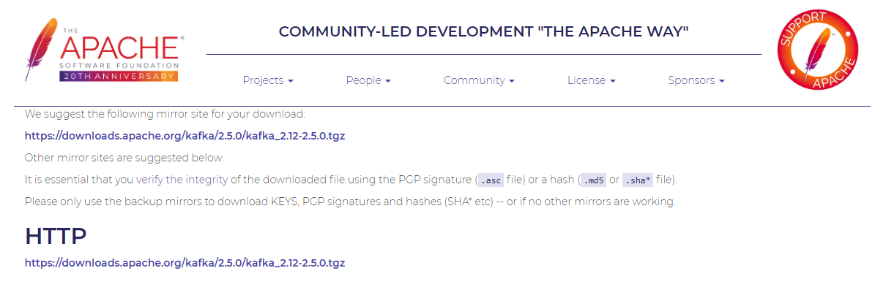
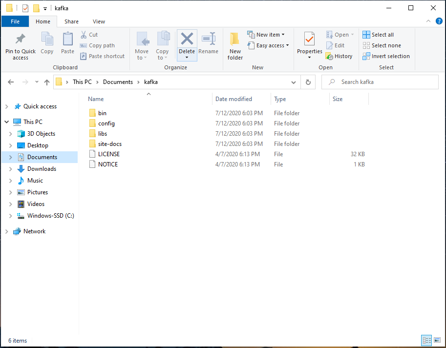

# Phase 5: Eventual Consistency

In this phase we will leverage [Apache Kafka](https://kafka.apache.org/intro) as a message broker to achieve eventual consistency for the multiple instances of our flashcard-service. Apache Kafka will allow us to setup topics for each of our services. Each service will be both a consumer and producer, so that every instance of the service can both send and receive messages to/from other instances. In this example we will be achieving eventual consistency across instances of a single domain, but we can also achieve it cross-domain as well.

The end result of this phase will be provided for comparison.

### Prerequisites

* Download [Apache Kafka](https://www.apache.org/dyn/closer.cgi?path=/kafka/2.5.0/kafka_2.12-2.5.0.tgz)



* Extract Archive to Documents Folder
  * Will need to extract twice
* Rename folder to just `kafka`



## Step 1: Start Zookeeper and Kafka

1. Open 2 separate PowerShell Windows in the `kafka/bin/windows/` folder
  * Most systems can Shift Right Click in a folder to open PowerShell

2. Run `.\zookeeper-server-start.bat ..\..\config\zookeeper.properties` in the first PowerShell Window

3. Run `.\kafka-server-start.bat ..\..\config\server.properties` in the second PowerShell Window

Note: Make sure to leave *both* PowerShell Windows open

The kafka server will be started at `localhost:9092`

## Step 2: Add Kafka Dependency

Edit the starters for both flashcard-service and flashcard-service2 and add the `Spring for Apache Kafka` Dependency

## Step 3: Configure Properties

Add the below snippet to the `flashcard.properties` file in the Centralized Configuration Repository:

```properties
# Configure Kafka Consumer
spring.kafka.consumer.bootstrap-servers=localhost:9092
spring.kafka.consumer.group-id=group-id
spring.kafka.consumer.auto-offset-reset=earliest
spring.kafka.consumer.properties.spring.json.trusted.packages=*
spring.kafka.consumer.key-deserializer=org.apache.kafka.common.serialization.StringDeserializer
spring.kafka.consumer.value-deserializer=org.springframework.kafka.support.serializer.JsonDeserializer

# Configure Kafka Producer
spring.kafka.producer.bootstrap-servers=localhost:9092
spring.kafka.producer.key-serializer=org.apache.kafka.common.serialization.StringSerializer
spring.kafka.producer.value-serializer=org.springframework.kafka.support.serializer.JsonSerializer
```

## Step 4: Create Flashcard Topic

In order to send/receive messages, there must be a topic. This can be created manually.

Open a *third* PowerShell Window in the same folder as Step 1.

Run `.\kafka-topics.bat --create --zookeeper localhost:2181 --topic flashcard --replication-factor 1 --partitions 1`

## Step 5: Create FlashcardChangeEvent

In order to send/reveive concise messages, we will create a `FlashcardChangeEvent` class that will contain the timestamp, operation, and corresponding Flashcard that is relevant to the message. This will allow us to identify messages based on the hashcode of the event object. We can track the events and prevent 1 instance from re-processing the message that it just sent out.

Perform the following in flashcard-service and then copy the files into flashcard-service2:

1. Create a `com.revature.events` package
2. Create an Enum called `Operation` and a class called `FlashcardChangeEvent` according to the below snippets:

Operation:
```java
public enum Operation {
  CREATE, UPDATE, DELETE
}
```

FlashcardChangeEvent:
```java
@Getter @Setter @NoArgsConstructor @AllArgsConstructor @EqualsAndHashCode @ToString
public class FlashcardChangeEvent {

  private Flashcard flashcard;
  private Operation operation;
  private LocalDateTime timestamp;
}
```

## Step 6: Create MessageService

We want to create a class that will manage sending and receiving messages according to the operation. We will create a `MessageService` class in the `com.revature.services` package.

MessageService:
```java
@Service
public class MessageService {

  private static Set<Integer> eventCache = new HashSet<>();

  @Autowired
  private FlashcardRepository flashcardDao;

  @Autowired
  private KafkaTemplate<String, FlashcardChangeEvent> kt;

  public void triggerEvent(FlashcardChangeEvent event) {
    eventCache.add(event.hashCode());

    kt.send("flashcard", event);
  }

  @KafkaListener(topics = "flashcard")
  public void processEvent(FlashcardChangeEvent event) {
    if(eventCache.contains(event.hashCode())) {
      eventCache.remove(event.hashCode());
      return;
    }

    switch(event.getOperation()) {
    case CREATE:
    case UPDATE:
      flashcardDao.save(event.getFlashcard());
      break;
    case DELETE:
      flashcardDao.delete(event.getFlashcard());
      break;
    }
  }
}
```

## Step 7: Leverage MessageService

Now that we have a service to handle all of the logic for sending and receiving messages, we will update out `FlashcardController` to leverage these.

Update the `FlashcardController` according to the below snippet:

```java
@Autowired
MessageService messageService;

  @PostMapping
  public ResponseEntity<Flashcard> insert(@RequestBody Flashcard flashcard) {
    int id = flashcard.getId();

    if(id != 0) {
      return ResponseEntity.badRequest().build();
    }

    messageService.triggerEvent(
        new FlashcardChangeEvent(flashcard, Operation.CREATE, LocalDateTime.now()));

    flashcardDao.save(flashcard);
    return ResponseEntity.status(201).body(flashcard);
  }

  @DeleteMapping("/{id}")
  public ResponseEntity<Flashcard> delete(@PathVariable("id") int id) {
    Optional<Flashcard> option = flashcardDao.findById(id);

    if(option.isPresent()) {
      messageService.triggerEvent(
          new FlashcardChangeEvent(option.get(), Operation.DELETE, LocalDateTime.now()));

      flashcardDao.delete(option.get());
      return ResponseEntity.accepted().body(option.get());
    }

    return ResponseEntity.notFound().build();
  }
```

Now when you launch all of the microservices, you will see that the 2 instances of the flashcard-service will no longer be out of sync. When you send a POST request to `localhost:8080/flashcard` to create a new Flashcard, that operation will be sent to the other instance to be replicated.

When you now send multiple GET requests to `localhost:8080/flashcard`, you should see that they will *eventually* synchronize (it is actually very quick).

## Troubleshooting

Note: The Kafka Server might stop with an error similar to:

```log
[2020-07-12 19:50:38,024] WARN [ReplicaManager broker=0] Stopping serving replicas in dir C:\tmp\kafka-logs (kafka.server.ReplicaManager)
[2020-07-12 19:50:38,073] ERROR Failed to clean up log for __consumer_offsets-13 in dir C:\tmp\kafka-logs due to IOException (kafka.server.LogDirFailureChannel)
java.nio.file.FileSystemException: C:\tmp\kafka-logs\__consumer_offsets-13\00000000000000000000.timeindex.cleaned: The process cannot access the file because it is being used by another process.

        at sun.nio.fs.WindowsException.translateToIOException(WindowsException.java:86)
        at sun.nio.fs.WindowsException.rethrowAsIOException(WindowsException.java:97)
        at sun.nio.fs.WindowsException.rethrowAsIOException(WindowsException.java:102)
        at sun.nio.fs.WindowsFileSystemProvider.implDelete(WindowsFileSystemProvider.java:269)
        at sun.nio.fs.AbstractFileSystemProvider.deleteIfExists(AbstractFileSystemProvider.java:108)
        at java.nio.file.Files.deleteIfExists(Files.java:1165)
        at kafka.log.Log$.deleteFileIfExists(Log.scala:2546)
        at kafka.log.LogSegment$.deleteIfExists(LogSegment.scala:669)
        at kafka.log.LogCleaner$.createNewCleanedSegment(LogCleaner.scala:435)
        at kafka.log.Cleaner.cleanSegments(LogCleaner.scala:547)
        at kafka.log.Cleaner.$anonfun$doClean$6(LogCleaner.scala:519)
        at kafka.log.Cleaner.doClean(LogCleaner.scala:518)
        at kafka.log.Cleaner.clean(LogCleaner.scala:492)
        at kafka.log.LogCleaner$CleanerThread.cleanLog(LogCleaner.scala:361)
        at kafka.log.LogCleaner$CleanerThread.cleanFilthiestLog(LogCleaner.scala:334)
        at kafka.log.LogCleaner$CleanerThread.tryCleanFilthiestLog(LogCleaner.scala:314)
        at kafka.log.LogCleaner$CleanerThread.doWork(LogCleaner.scala:303)
        at kafka.utils.ShutdownableThread.run(ShutdownableThread.scala:96)
[2020-07-12 19:50:38,076] WARN [ReplicaManager broker=0] Broker 0 stopped fetcher for partitions  and stopped moving logs for partitions  because they are in the failed log directory C:\tmp\kafka-logs. (kafka.server.ReplicaManager)
[2020-07-12 19:50:38,080] WARN Stopping serving logs in dir C:\tmp\kafka-logs (kafka.log.LogManager)
[2020-07-12 19:50:38,089] ERROR Shutdown broker because all log dirs in C:\tmp\kafka-logs have failed (kafka.log.LogManager)
```

If this occurs, perform the following:

1. Edit the `server.properties` file in the `kafka/config/` folder
  * Change the `log.dirs` property to something else, such as `log.dirs=\tmp\kafka\kafka-test-logs`
2. Restart kafka server with `.\kafka-server-start.bat ..\..\config\server.properties`


You may also occasionally want to restart both Zookeeper and Kafka. In which case, first shut down Kafka with `CTRL - C` in the PowerShell Window that is running Kafka, and then shutdown Zookeeper in the same way. Then restart them with the commands used in Step 1.

## Summary

We have solved the long-standing issue of data consistency that arose with our distributed databases. We could have changed the H2 databases in the flashcard-services to both use the same database to avoid this problem entirely. But properly achieving eventual consistency allows for efficiently scaling the number of GET requests you can process at any given time.

Instead of purchasing larger servers for our databases to process more requests per second, we can instead horizontally scale our databases.

Keep in mind that eventual consistency here is performing data replication, so if your particular use-case requires a lot of creation/modification of data, you might not find as much benefit in eventual consistency.
